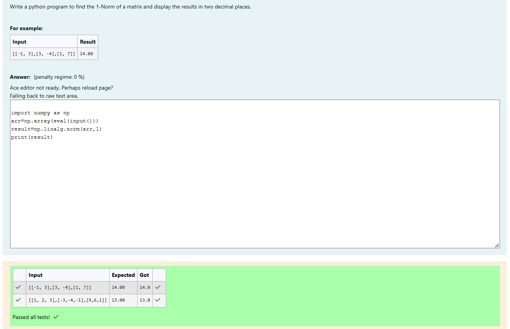
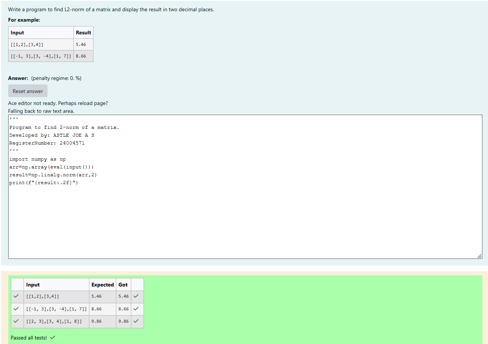
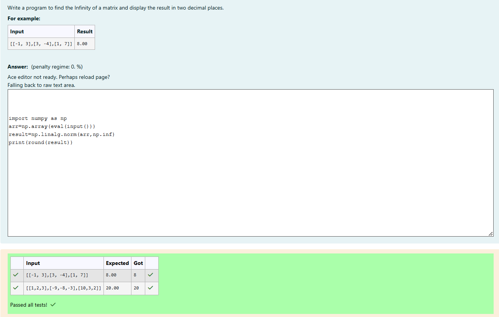

# Norm of a matrix
## Aim
To write a program to find the 1-norm, 2-norm and infinity norm of the matrix and display the result in two decimal places.
## Equipment’s required:
1.	Hardware – PCs
2.	Anaconda – Python 3.7 Installation / Moodle-Code Runner
## Algorithm:
```
1-Norm of a Matrix:
	1.import numpy as np .
	2.Use np.linalg.norm with the ord=1 argument to calculate the 1-norm.
	3.Print the result
```
```
2-Norm of a Matrix
	 1.import numpy as np
	 2.Accept the matrix as input ( use eval(input())).
	 3.Use NumPy’s np.linalg.norm(arr, 2) to calculate the Euclidean norm 
	 4.Print the result, formatted to two decimal places.
	 Infinity Norm of a Matrix
```
```
Infinity Norm of a Matrix:
	1.import numpy as np
	2.Accept the matrix as input ( using eval(input())).
	3.Convert the input matrix into a NumPy array.
	4.Use np.linalg.norm(arr, np.inf) to calculate the infinity norm.
	5.Round the result to the nearest integer and print it.
```
## Program:
```
# Register No:24004571
# Developed By:ASTLE JOE A S
```
```
# 1-Norm of a Matrix
import numpy as np
arr=np.array(eval(input()))
result=np.linalg.norm(arr,1)
print(result)
```

```
# 2-Norm of a Matrix
import numpy as np
arr=np.array(eval(input()))
result=np.linalg.norm(arr,2)
print(f"{result:.2f}")
```

```
# Infinity Norm of a Matrix

import numpy as np
arr=np.array(eval(input()))
result=np.linalg.norm(arr,np.inf)
print(round(result))
```
## Output:
### 1-Norm of a Matrix

<br>
<br>
<br>

### 2-Norm of a Matrix

<br>
<br>
<br>

### Infinity Norm of a Matrix

<br>
<br>
<br>

## Result
Thus the program for 1-norm, 2-norm and Infinity norm of a matrix are written and verified.
